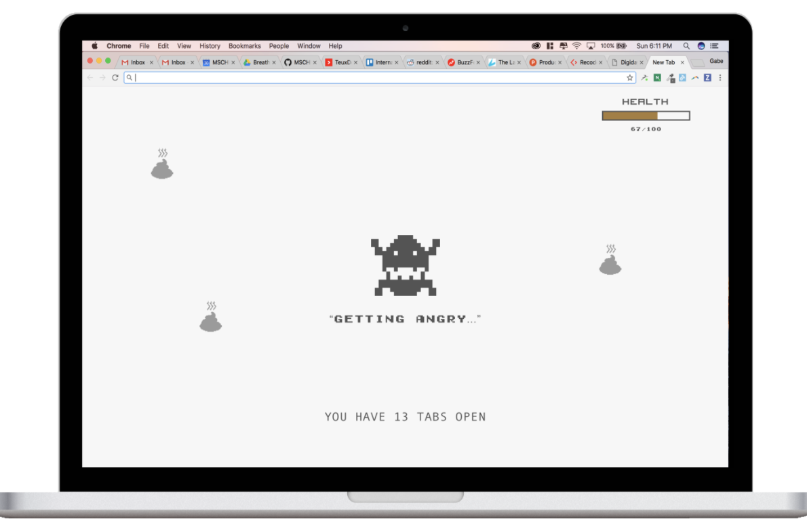

Note: this is a re-upload of Breather's Tabagotchi from [ChromeStats](https://chrome-stats.com/d/ojahbhfflnbaiddhnkgeccgopmedjjen). The original extension is [no longer up on the chrome web store](https://chrome.google.com/webstore/detail/tabagotchi-by-breather/ojahbhfflnbaiddhnkgeccgopmedjjen), so I wanted to re-upload the source.

---

# Tabagotchi

## What's in here?

This project uses a workflow that incorporates Gulp for linting, minifying, and concatenating. As such, the index.html file that gets inserted into each new tab only uses `dist/js/script.js`. You should **NOT** be inserting any of the JS from `src/js` into the index.html file. 

## Resources:

- https://chrome.google.com/webstore/detail/tab-count/cfokcacdaonnckdmopmcgeanhkebeaio?hl=en
- https://stackoverflow.com/questions/42109296/is-there-any-way-to-count-number-of-tabs-are-opened-in-chrome
- https://developer.chrome.com/extensions/tabs#method-query
- https://developer.chrome.com/extensions/storage
- https://developer.chrome.com/extensions/tabs#method-sendMessage
- https://developer.chrome.com/extensions/runtime#event-onMessage
- https://gist.github.com/ohizkiya/4645d7234ea906230b90
- https://stackoverflow.com/questions/31799903/persist-a-page-actions-state-in-a-chrome-extension
- https://stackoverflow.com/questions/5364062/how-can-i-save-information-locally-in-my-chrome-extension
- https://stackoverflow.com/questions/27084795/chrome-extension-send-data-between-tabs
- https://developer.chrome.com/extensions/background_pages
- https://stackoverflow.com/questions/23339944/remember-state-chrome-extension
- https://stackoverflow.com/questions/24919002/chrome-storage-onchanged-between-extensions-background-and-popup
